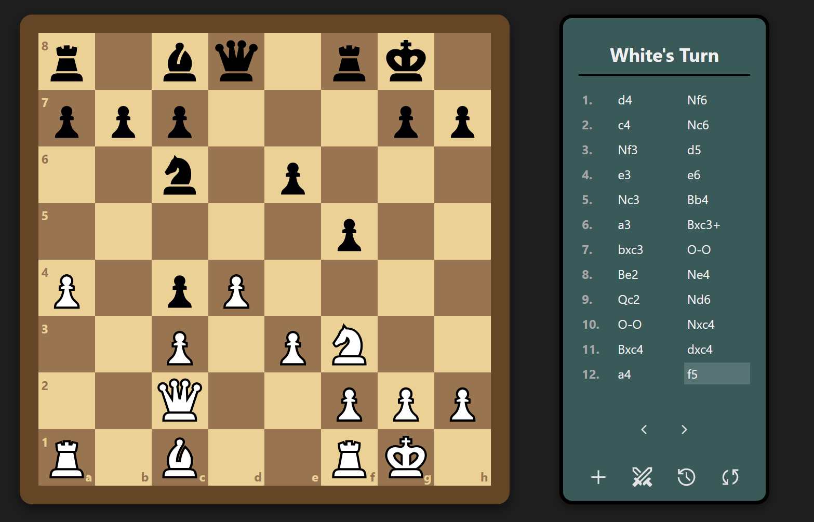
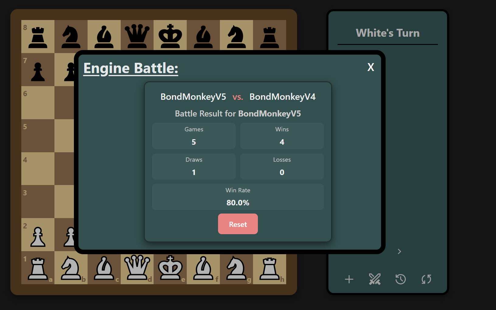
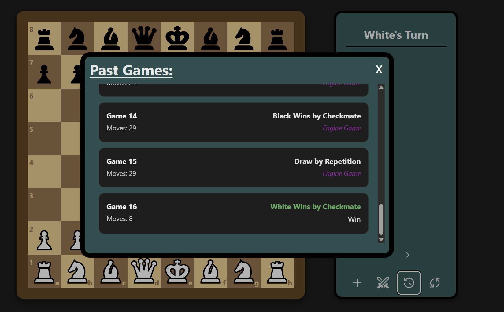

# Bondmonkey

**Bondmonkey** is a web-based JavaScript chess engine that pits you against five
progressively stronger AI versions. Built for fun and learning, it uses
bitboards, magic bitboards, and optimized negamax with alpha-beta pruning to
deliver competitive play and a “battle mode” that lets two engines face off
head-to-head.

[▶️ Play Bondmonkey](https://brandony16.github.io/Chess_Engine/)

---

## 🗂️ Table of Contents

1. [Short Description](#-short-description)
2. [Demo / Screenshots](#-demo--screenshots)
3. [Local Installation](#-local-installation)
4. [Features](#-features)
5. [Usage](#-usage)
6. [Architecture & Implementation](#-architecture--implementation)
7. [Tests](#-tests)
8. [Author](#-author)
9. [Tools & Libraries](#-tools--libraries)

---

## 📝 Short Description

Bondmonkey is designed to be both a learning project and a playable chess
engine. Choose your difficulty, challenge yourself, or watch two AI versions
duke it out in “Battle Mode”.

---

## 🎬 Demo / Screenshots

  
_Figure 1: Main playing board against Bondmonkey V5._

  
_Figure 2: Battle Mode Result for BMV5 vs BMV4_


_Figure 3: Viewing past games_

---

## 💾 Local Installation

```bash
# 1. Clone this repo
git clone https://github.com/brandony16/Chess_Engine.git
cd Chess_Engine

# 2. Install dependencies
npm install

# 3. Run in development mode
npm run dev

# 4. Build for production
npm run build
```

- Note on openings: When engines battle, they first play a random opening found
  in openings.json. This was generated using the build-openings.js file in the
  scripts folder. To generate your own openings, first download a pgn file of
  openings and put it into the root of the project. Then in build-openings.js,
  change the PGN_PATH variable to the name of your pgn file, and tweak any other
  settings at the top.

You can then run

```bash
npm run build-openings
```

to build the openings file.

---

## ✨ Features

- Five difficulty levels
- "Battle Mode" for engine vs. engine matches
- Ability to view past games and look through the moves
- Highlighting showing the legal moves of a piece
- Full move generation and legal move filtering
- Optimized search using negamax, alpha-beta pruning, and move ordering
- Advanced techniques like magic bitboards for sliding-piece attacks
- Peft test suite for validating move generation counts

---

## 🚀 Usage

- **Play Bondmonkey:**

  1. Open http://localhost:5173 (or the URL printed by Vite) if running locally,
     or the [website](https://brandony16.github.io/Chess_Engine/).
  2. Start playing by clicking on a piece then clicking on where you want to
     move it.

  - By default, you will play Bondmonkey V5 at a depth of 5, with a max time of
    5s per search.

- **Sidebar:**

  - The sidebar displays game info such as whose turn it is and the past moves
    of the game in algebraic chess notation.
  - It also has buttons for starting a new game, starting an engine battle,
    viewing past games, and flipping the board on the bottom of the sidebar.
  - Clicking on a past move on the side bar will allow you to view how the board
    looked at that move.
  - The arrows below the move list move one move back and forward respectively.

- **Change Engine Settings:**

  1. Click the plus button on the bottom left side of the sidebar.
  2. Make selections on engine version, engine depth, engine time limit, and
     which side you want to play.
  3. Start a new game and let the battle begin!

- **Battle Mode:**

  1. Click the sword icon on the bottom of the sidebar to open the battle engine
     menu.
  2. Select which versions of Bondmonkey you want to battle, and which depth
     each should search to in ply (half-moves).
  3. Click start and wait for the battle to finish (keep depths and games low to
     reduce search time).
  4. View the results of the battle such as wins, losses, and draws.

- **Past Games:**

  - When you finish a game it will be automatically stored in past games.
  - You can them go back and view these games you (or the engine) played.
  - Click on a game to view it and look through the moves.
  - NOTE: Previous games are lost when the page refreshes.

- **Other Usage Notes:**
  - Search times will depend on hardware, but depths above 6 or 7 can start to
    take a while.
  - Higher depths are also not recommended when simulating engine games due to
    long wait times.

---

## 🏗️ Architecture & Implementation

- **Bitboards**

  - The board is stored as an array of 12 bitboards, which are 64 bit integers.
    There is one bitboard for every type of piece (pawn, knight, bishop, rook,
    queen, and king for both sides), with a 1 in binary where ever that type of
    piece is. This allows for very fast bitwise operations and bitshifts for
    maximum performance.
  - See the
    [ChessProgrammingWiki](https://www.chessprogramming.org/Bitboard_Board-Definition)
    for more

- **Searching**

  - Searching is done with the negamax algorithm, which recursively calls
    itself.
  - On each pass, it trys to maximize the score for one player by simulating all
    legal moves then evaluating them. For each move it simulates, it recusively
    calls itself, this time maximizing the other players score.
  - Bondmonkey V5 speeds up searching with techniques such as alpha-beta
    pruning, move ordering, transposition tables, killer moves, and history
    heuristics. These all work to reduce the number of nodes that are searched.
    Move info can be found on each of these techniques at the
    [ChessProgrammingWiki](https://www.chessprogramming.org/Main_Page).

  - Later versions also include quiescence search, which is a special type of
    search that only simulates captures and promotions. This helps reduce the
    "horizon effect," which occurs when an engine misevaluates a capture
    sequence due to hitting the max depth.
  - This type of search is done after hitting the initial max depth.

- **Move Generation**

  - Move generation is done by first finding all of the pseudo legal moves in a
    position. These are the moves that follow that pieces moving rules, but do
    not take into account whether the king is in check or if the king will be
    put in check by a move.
  - Pseudo legal moves are generated using precalculated movement tables for
    non-sliding pieces (king, pawn, and knight); and using magic bitboards for
    the sliding pieces (bishop, rook, queen).
  - Magic bitboards are a technique where by multiplying the relevant occupancy
    bitboard by a precomputed "magic number" then shifting the result to isolate
    some number of bits, one can get a unique index. This index then can be used
    on a precomputed move lookup table to get the moves for the piece. A better
    explanation of magic bitboards can be found on the
    [Chess Programming Wiki](https://www.chessprogramming.org/Magic_Bitboards)
  - This is required on sliding pieces as those pieces are affected by other
    pieces blocking them, so their moves aren't constant.
  - Pieces like the pawn, knight, and king arent affected by blockers. (NOTE:
    Pawn moves forward can be blocked, but those pawn moves are simply
    recalculated every time since at most you have to check 2 squares and its
    not worth it to do a bunch of magic bitboard lookups.)

- **Evaluation**

  - The evaluation function for V5 is still fairly simple, just consisting of
    raw material count and piece-square tables(PSQT).
  - The piece weights are slightly more nuanced than the traditional 1 point for
    a pawn, 3 for knights and bishops, 5 for rooks, and 9 for queens. This means
    the engine will favor some interactions, such as not exchanging a bishop for
    a knight normally.
  - More info on the weights used can be found
    [here](https://www.chessprogramming.org/Simplified_Evaluation_Function)
  - The piece-square tables are arrays with 64 entries, one for each square. By
    assigning slight weights to each square, the engine will favor placing its
    pieces on "active" squares, and will be biased against placing its piece on
    "bad" squares (such as a knight on the edge of the board).
  - More info on PSQT can be found
    [here](https://www.chessprogramming.org/Piece-Square_Tables)

  - The simplicity of the current evaluation function means this is an area that
    has potential to be improved significantly.

- **Current Versions**
  - There are currently 5 versions of Bondmonkey. Each builds off of the
    previous, adding one or two more features for improved performance.
  - V1: Plays moves completely randomly
  - V2: Implements minimax function with aplha-beta pruning and very basic move
    sorting. Evaluation is purely material based.
  - V3: Adds transposition table, killer moves, and history heuristic for better
    move sorting and quicker pruning.
  - V4: Adds quiescence search that is done after normal search to eliminate the
    horizon effect. Slight tweak to weights in evaluation function
  - V5: Improves evaluation using piece-square tables.

---

## 🧪 Tests

To run the test suites:

```bash
# Clone the repository
git clone https://github.com/brandony16/Chess_Engine.git
cd Chess_Engine

# Install dependencies
npm install

# Run all test suites
npm test

# Run a specific test suite
npm run test -- [file_name]
```

**Perft Tests**

- Perft testing is a method of testing the move generation function in chess
  engines so ensure it is accurate. The test works by counting how many
  different nodes (positions) there are at a certain depth. For example, in the
  starting position, white has 20 moves, so perft at depth 1 for the position
  is 20. After white moves, black also has 20 moves, so perft at depth 2 is 400.
- Move info on perft testing can be found
  [here](https://www.chessprogramming.org/Perft)

**To run perft (performance test) cases:**

- Navigate to the perft.test.mjs file under the **tests** folder.
- In the cases array at the top, comment out or delete any cases you dont want
  to run, and add any cases you do want to run.
- New perft cases should be an array with the first value being a string for the
  title of the test, then an integer for the deprth to search, then the expected
  node count for the test, and finally the FEN string of the position you want
  to run perft on.
- The test suite can be run with `npm test perft`

---

## 👤 Author

**Brandon Young**

- GitHub: [brandony16](https://github.com/brandony16)
- Email: [brandony16@vt.edu](mailto:brandony16@vt.edu)

Feel free to contact me!

---

## 🛠 Tools & Libraries

- **Stockfish** – High‑performance open‑source chess engine  
  https://stockfishchess.org/

- **Lichess** – Opening data & SVG piece icons

  - Lichess Master Openings: https://database.nikonoel.fr/
  - mpchess pieces:
    https://github.com/lichess-org/lila/tree/master/public/piece/mpchess

- **Jest** – JavaScript testing framework  
  https://jestjs.io/

- **React** – UI library for building interactive components  
  https://reactjs.org/

- **Vite** – Fast frontend build tool & dev server  
  https://vitejs.dev/

- **Material Icons (Google Icons)** – Free SVG icon set  
  https://fonts.google.com/icons

- **Chess.js** – Move generation & chess logic for some tests  
  https://github.com/jhlywa/chess.js/

- **Zustand** – Lightweight state management for React  
  https://github.com/pmndrs/zustand

- **Chess Programming Wiki** – Deep dive on chess engines programming and
  algorithms  
  https://www.chessprogramming.org/
